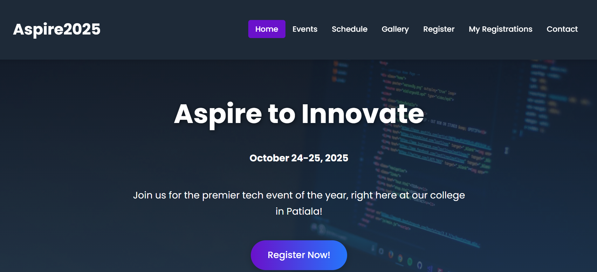

# Aspire2025 - College Tech Fest Website

A complete, multi-page, responsive website for a fictional college tech fest, "Aspire2025." This project was built as a lab assignment to demonstrate core front-end web development skills.

**Live Demo:** [Link to your live site here](videos/Recording.mp4/)

---

## Screenshot



---

## ✨ Features

This website is a complete front-end application with a rich set of features:

* **Fully Responsive Design:** Adapts seamlessly to desktops, tablets, and mobile devices using modern CSS Flexbox and Grid.
* **Multi-Page Structure:** A complete 7-page website including:
    * Homepage with an engaging hero section and video.
    * Events page.
    * Interactive Schedule table.
    * Photo Gallery with a clickable lightbox feature.
    * Registration Form with client-side validation.
    * "My Registrations" page to view and delete entries.
    * Contact & FAQs page.
* **Mobile Hamburger Menu:** A clean, functional navigation menu for small screens.
* **Client-Side Registration System:** Uses JavaScript and browser `localStorage` to create a working registration system without a backend. Users can register, view their registrations, and delete them.
* **Interactive UI:** Smooth animations, hover effects, and a functional lightbox gallery provide a dynamic user experience.
* **SEO Friendly:** Uses semantic HTML, meta tags, and image alt text for better search engine visibility.

---

## 🛠️ Technologies Used

This project was built using fundamental web technologies:

* **HTML5:** For the structure and content.
* **CSS3:** For styling, layout, and animations.
    * CSS Variables
    * Flexbox
    * CSS Grid
    * Media Queries
* **JavaScript (ES6+):** For all interactive functionality, including form handling, the mobile menu, and the lightbox gallery.

---

## 📁 File Structure

The project is organized with a clean and maintainable file structure:
```
Aspire2025/
├── audio/
│ └── intro.mp3
├── css/
│ └── style.css
├── js/
│ └── script.js
├── images/
│ ├── clash.png
│ ├── clash24.png
│ ├── codestorm.png
│ ├── codestorm2024.png
│ ├── codestorm_challenge.png
│ ├── design_winner.png
│ ├── designx.png
│ ├── discuss.png
│ ├── discuss2.png
│ ├── girl.png
│ ├── hackathon_speech.png
│ ├── in.png
│ ├── inaugration.png
│ ├── inaugration_speech.png
│ ├── night.png
│ ├── presentation.png
│ ├── problem.png
│ ├── robot.png
│ ├── robowar_making.png
│ ├── showcase.png
│ ├── students.png
│ ├── win.png
│ └── winners.png
├── videos/
│ ├── Introduction.mp4
│ └── Recording.mp4
├── index.html
├── events.html
├── schedule.html
├── register.html
├── my-registrations.html
├── gallery.html
├── prev_gallery.html
└── contact.html
```

---

## 🚀 How to Run Locally

To run this project on your local machine:

1.  **Clone the repository (or download the ZIP file):**
    ```bash
    git clone [https://github.com/Akshat0612/Techfest-Aspire2025](https://github.com/Akshat0612/Techfest-Aspire2025)
    ```
2.  **Navigate to the project directory:**
    ```bash
    cd Techfest-Aspire2025
    ```
3.  **Open `index.html` in your web browser:**
    * Simply double-click the `index.html` file, or right-click and choose "Open with" your favorite browser.

---

## ✍️ Author

* **Akshat Goyal**
    * GitHub: [@Akshat0612](https://github.com/Akshat0612)
    * LinkedIn: [linkedin.com/in/akshatgoyal06](https://www.linkedin.com/in/akshatgoyal06/)
